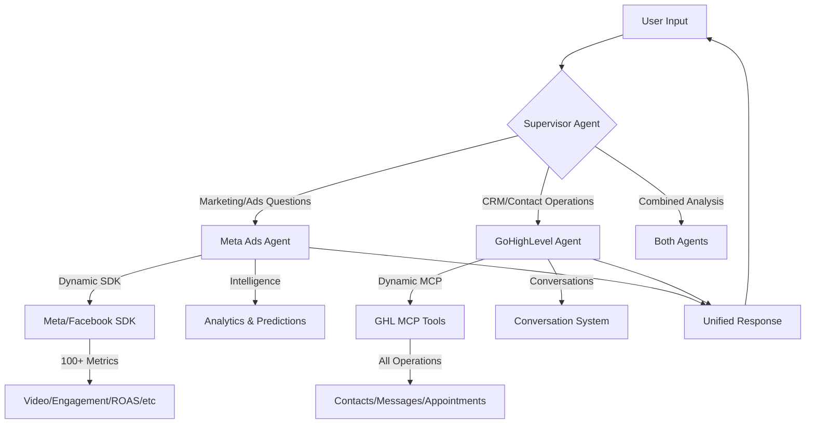

# Multi-Agent System Architecture for Ryan Castro Campaign

## System Overview



## Architecture Components

### 1. **Supervisor Agent** (Orchestrator)
- **Role**: Routes requests to appropriate agents
- **Decisions**:
  - Meta Ads Agent: Campaign performance, ad metrics, ROAS
  - GoHighLevel Agent: Contacts, messages, appointments, CRM
  - Both: Cross-platform analytics (e.g., "How many Miami leads converted?")
- **Features**:
  - Intent detection
  - Task delegation
  - Response aggregation

### 2. **Meta Ads Agent** (Marketing Analytics)
- **Capabilities**:
  - Dynamic SDK access (100+ metrics)
  - Conversational responses
  - Full report generation
  - Intelligence layer (health scoring, predictions)
- **Handles**:
  - Campaign performance
  - Location-specific metrics
  - Video/engagement analytics
  - ROAS calculations

### 3. **GoHighLevel Agent** (CRM Operations)
- **Capabilities**:
  - Dynamic MCP tool discovery
  - Conversation-based messaging (NOT webhooks)
  - Contact management
  - Appointment scheduling
- **Handles**:
  - Contact operations
  - Message sending (via conversations)
  - Lead management
  - Pipeline operations

## Communication Flow

### Example 1: Marketing Query
```
User: "How's Miami doing?"
  ↓
Supervisor: Routes to Meta Ads Agent
  ↓
Meta Agent: Fetches Miami-specific metrics
  ↓
Response: "Miami shows 234 impressions with 47% CTR, up 12% from last week"
```

### Example 2: CRM Operation
```
User: "Send follow-up to VIP ticket holders"
  ↓
Supervisor: Routes to GoHighLevel Agent
  ↓
GHL Agent: Sends via conversation system
  ↓
Response: "Sent follow-up messages to 45 VIP contacts"
```

### Example 3: Combined Analysis
```
User: "What's the conversion rate for Miami Facebook ads?"
  ↓
Supervisor: Routes to BOTH agents
  ↓
Meta Agent: Gets ad performance (234 leads)
GHL Agent: Gets conversion data (47 sales)
  ↓
Response: "Miami Facebook ads: 234 leads, 47 conversions (20.1% rate)"
```

## Key Design Principles

### 1. **Dynamic Discovery**
- Meta Agent: Discovers metrics from SDK at runtime
- GHL Agent: Discovers MCP tools dynamically
- No hardcoded limitations

### 2. **Conversational Interface**
- Quick answers for simple questions
- Full reports only when requested
- Natural language understanding

### 3. **Secure Messaging**
- All GHL messages via conversation threads
- NO webhook endpoints
- Future: Phone number verification

### 4. **Intelligent Routing**
- Supervisor uses LLM for intent detection
- Handoffs between agents
- State sharing for context

## Implementation Strategy

### Phase 1: Supervisor Setup
```python
supervisor = create_supervisor(
    model="gpt-4",
    agents=[meta_agent, ghl_agent],
    routing_strategy="intent_based"
)
```

### Phase 2: Agent Handoffs
```python
# Handoff tools for supervisor
transfer_to_meta = create_handoff_tool("meta_agent")
transfer_to_ghl = create_handoff_tool("ghl_agent")
```

### Phase 3: State Management
```python
class CampaignState(TypedDict):
    messages: List[Message]
    campaign_id: str
    contact_id: Optional[str]
    current_agent: str
    results: Dict[str, Any]
```

## Benefits of This Architecture

1. **Modularity**: Each agent is independent and specialized
2. **Scalability**: Easy to add new agents (e.g., Email Agent, Analytics Agent)
3. **Maintainability**: Clear separation of concerns
4. **Flexibility**: Agents can be updated independently
5. **Intelligence**: Each agent can evolve its capabilities

## Future Enhancements

1. **Security Layer**: Phone number verification for GHL operations
2. **Memory System**: Long-term memory for user preferences
3. **Learning Loop**: Improve routing based on usage patterns
4. **Additional Agents**:
   - Email Campaign Agent
   - Social Media Agent
   - Analytics Dashboard Agent
5. **Cross-Agent Intelligence**: Agents learn from each other's data

## Testing Strategy

1. **Unit Tests**: Each agent independently
2. **Integration Tests**: Handoffs between agents
3. **End-to-End Tests**: Complete user flows
4. **Performance Tests**: Response time optimization

## Deployment Considerations

1. **LangGraph Platform**: Deploy on LangGraph Cloud
2. **Monitoring**: Track agent performance
3. **Logging**: Detailed logs for debugging
4. **Versioning**: Independent agent versions
5. **Rollback**: Safe rollback strategy

This architecture provides a robust, scalable foundation for managing Ryan Castro's campaign across multiple platforms while maintaining clean separation of concerns and allowing for future growth.