# Meta Ryan System Flow Diagram

## Main System Architecture Flow

```mermaid
graph TB
    %% Entry Points
    User[("👤 User<br/>(Phone/Message)")] 
    
    %% Security Layer
    Security["🔐 Security Agent<br/>─────────────<br/>• Phone Validation<br/>• Permission Check<br/>• Rate Limiting<br/>• Audit Logging"]
    
    %% Supervisor
    Supervisor["🎯 Supervisor Agent<br/>─────────────<br/>• Intent Analysis<br/>• Agent Routing<br/>• Response Aggregation"]
    
    %% Core Agents
    MetaAgent["📊 Meta Campaign Agent<br/>─────────────<br/>• Campaign Analysis<br/>• ROAS Calculation<br/>• City Performance<br/>• Dynamic SDK Queries"]
    
    GHLAgent["📱 GoHighLevel Agent<br/>─────────────<br/>• CRM Operations<br/>• Message Sending<br/>• Contact Management<br/>• MCP Tool Execution"]
    
    %% Data Sources
    MetaAPI[("Meta/Facebook API<br/>Campaign Data")]
    GHLAPI[("GoHighLevel API<br/>CRM Data")]
    
    %% Response
    Response[("📤 Response<br/>via GHL SMS/WhatsApp")]
    
    %% Flow connections
    User -->|"1. Request"| Security
    Security -->|"2. Validated"| Supervisor
    Security -.->|"Denied"| User
    
    Supervisor -->|"3a. Campaign Query"| MetaAgent
    Supervisor -->|"3b. CRM Operation"| GHLAgent
    
    MetaAgent -->|"4a. Fetch Data"| MetaAPI
    MetaAPI -->|"5a. Campaign Data"| MetaAgent
    
    GHLAgent -->|"4b. Execute"| GHLAPI
    GHLAPI -->|"5b. CRM Data"| GHLAgent
    
    MetaAgent -->|"6a. Analysis Result"| Supervisor
    GHLAgent -->|"6b. Operation Result"| Supervisor
    
    Supervisor -->|"7. Send Response"| GHLAgent
    GHLAgent -->|"8. Deliver"| Response
    Response -->|"9. Final"| User
    
    %% Styling
    classDef security fill:#ff6b6b,stroke:#c92a2a,color:#fff
    classDef supervisor fill:#4c6ef5,stroke:#364fc7,color:#fff
    classDef meta fill:#7950f2,stroke:#5f3dc4,color:#fff
    classDef ghl fill:#20c997,stroke:#0ca678,color:#fff
    classDef data fill:#868e96,stroke:#495057,color:#fff
    classDef user fill:#fab005,stroke:#f59f00,color:#000
    
    class Security security
    class Supervisor supervisor
    class MetaAgent meta
    class GHLAgent ghl
    class MetaAPI,GHLAPI data
    class User,Response user
```

## Detailed Security Flow

```mermaid
graph LR
    subgraph "Security Validation Process"
        Phone[Phone Number] --> Check1{Authorized?}
        Check1 -->|No| Deny1[Access Denied]
        Check1 -->|Yes| Check2{Locked Out?}
        Check2 -->|Yes| Deny2[Account Locked]
        Check2 -->|No| Check3{Has Permission?}
        Check3 -->|No| Deny3[Permission Denied]
        Check3 -->|Yes| Check4{Rate Limit OK?}
        Check4 -->|No| Deny4[Rate Limited]
        Check4 -->|Yes| Allow[✅ Access Granted]
    end
    
    Allow --> Role[Assign Role & Context]
    Role --> NextAgent[Route to Agent]
```

## Meta Campaign Agent Flow

## Question Processing Flow

## State Flow Through System

## Data Flow for Campaign Analysis

```mermaid
graph LR
    subgraph "Input Processing"
        Q[Question] --> NLP[NLP Processing]
        NLP --> E[Entities<br/>• Location<br/>• Metric<br/>• Time Period]
    end
    
    subgraph "Query Building"
        E --> QB[Query Builder]
        QB --> SQL[SDK Query<br/>• Fields<br/>• Filters<br/>• Breakdowns]
    end
    
    subgraph "Data Fetching"
        SQL --> API[Meta API]
        API --> Raw[Raw Data]
    end
    
    subgraph "Processing"
        Raw --> Agg[Aggregation]
        Agg --> Calc[Calculations<br/>• CTR<br/>• ROAS<br/>• CPC]
    end
    
    subgraph "Response"
        Calc --> Fmt[Format]
        Fmt --> Ans[Answer]
    end
```

## Agent Communication Protocol

```mermaid
graph TD
    subgraph "Message Format"
        State["State Object<br/>─────────<br/>• messages[]<br/>• phone_number<br/>• user_role<br/>• permissions[]<br/>• current_request<br/>• intent<br/>• responses{}"]
    end
    
    subgraph "Agent Handoffs"
        Sup[Supervisor] -->|"State + Context"| Meta[Meta Agent]
        Sup -->|"State + Context"| GHL[GHL Agent]
        Meta -->|"Result + State"| Sup
        GHL -->|"Result + State"| Sup
    end
    
    subgraph "Security Context"
        Ctx["Security Context<br/>─────────<br/>• authenticated: true<br/>• phone: +1786xxx<br/>• role: admin<br/>• timestamp: ISO"]
    end
```

## Error Handling Flow

## Typical User Journey

## System Components Interaction

This diagram shows the complete flow of the Meta Ryan system, from user request through security validation, agent routing, data processing, and response delivery.